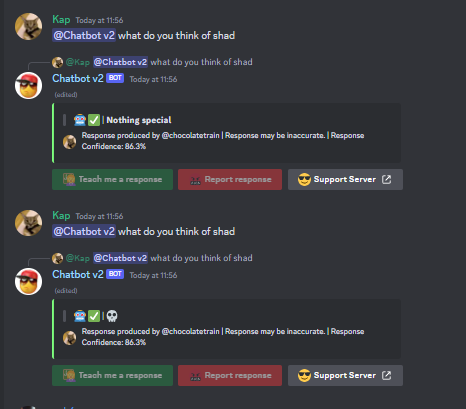
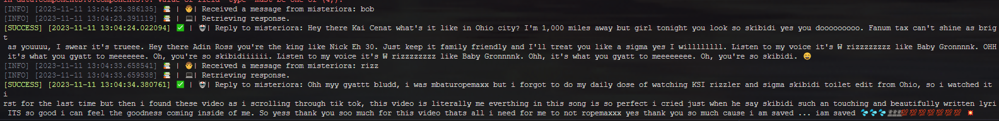

# Discord Chatbot v2

### **Overview**
A Discord "chatbot" that replies with pre-generated responses that appropriately match your message.

If you say "How are you?", the chatbot will respond with something like "I'm good! And you?".

### **Features**
- Profanity detection
- Fast responses
- Extendable code
- Easy to setup

### **How To Use**
1) `git clone` this repo.
```
git clone https://github.com/Cuh4/DiscordChatbotV2
```

2) Create a Discord bot at https://discord.com/developers/applications.

3) In the `src` folder, edit `example_config.py` then rename to `config.py` when completed. Be sure to plop your bot's token in the config file.

4) Start the bot using the following commands:
```
cd src
py main.py
```

5) Invite your bot to a server.

6) Talk to the bot by mentioning it and saying whatever.

### **Images**




